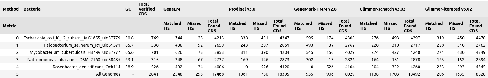

<div align="center" style="">
  <br>
  
  <br>
  <!-- <h1>GeneLM</h1> -->
  GeneLM: Gene Language Model for Translation Initiation Site Prediction in Bacteria
  <br>
  <br>

  [](https://doi.org/10.1101/2025.03.20.644312)
  [](https://huggingface.co/Genereux-akotenou/BacteriaCDS-DNABERT-K6-89M)
  [](https://huggingface.co/Genereux-akotenou/BacteriaTIS-DNABERT-K6-89M)
  [](https://hub.docker.com/r/13365920/genelm-webtool)
</div>

## GeneLM

<!-- [](./webtool/ui/static/demo-gene-prediction-prokaryotes.mp4) -->
<a href="https://genereux-akotenou.github.io/assets/images/demo-gene-prediction-prokaryotes.mp4" target="_blank">
  
</a>

GeneLM: Gene Language Model for Translation Initiation Site Prediction in Bacteria. This repository includes the implementation of GeneLM, a genomic language model designed for predicting coding sequences (CDS) and refining Translation Initiation Sites (TIS) in bacterial genomes. The model operates through a two-stage genomic language model pipeline. In this package, we provide resources including: source codes of the GeneLM model, usage examples, pre-trained models, fine-tuned models, and a web-based visualization tool. The repository is still under development, and more features will be included gradually. Training of GeneLM consists of general-purpose pre-training and task-specific fine-tuning. The code for model training can be found in the subfolder [finetune](./finetune/), while the web tool we developed can be found in the subfolder [webtool](./webtool/). Our implementation extends existing transformer-based models and adapts them for genomic sequence analysis.

## Benchmark

We evaluated our approach against the widely used gene annotation tool, Prodigal, on an experimentally verified bacterial dataset. The results of this comparison are presented in the image below. You can access our [pre-print here](https://www.biorxiv.org/content/early/2025/03/22/2025.03.20.644312.full.pdf). 



## 1. Web tools

To streamline gene annotation after model training, we developed a post-processing pipeline that integrates an interactive web interface and an API-based system.

Our web-based annotation tool allows users to submit genome sequences for automatic annotation. It supports two input modes: 
1. **Direct input** – Users can paste a genome sequence into the provided text area.
2. **File upload** – Users can upload a FASTA file for processing.

After providing input, users can specify the desired output format (GFF or CSV). Once submitted, the system processes the annotation and generates structured output files. A preview of the interface is shown below:


### 1.1 Setting Up the Environment


> #### 📦 **Quick Start**
> To speed up the setup process, you can simply run the `webtool/setup-and-run.sh` script. This script will automatically create the Python environment, install the necessary dependencies, and start both the API and the web tool services for you. Please make sure that ports 8501 (for the web UI) and 8000 (for the API) are available on your machine. To proceed, make the script executable (`chmod +x setup-and-run.sh`) and run it (`./setup-and-run.sh`). If any errors occur during execution, you can still perform the setup manually by following the detailed steps described below.
>
> #### 🐳 **Docker Support Available**
> A complete Docker setup is now provided to simplify deployment across any environment with NVIDIA GPU support.
>  **Check out the Docker setup and usage instructions in** [`README.Docker.md`](./webtool/README.Docker.md) to build from Docker. Or you can get the pre-build image of GeneLM from hub and use it direclty doing:
> ```bash
> docker pull 13365920/genelm-webtool:latest
> docker run --gpus all -p 8501:8501 -p 8000:8000 13365920/genelm-webtool:latest
> ```

#### Step 1: Create a Python Environment
```sh
git clone https://github.com/Bioinformatics-UM6P/GeneLM
cd webtool
python -m venv venv
```

#### Step 2: Activate the Environment
```sh
source ./venv/bin/activate
```

#### Step 3: Install Dependencies
```sh
pip install -r requirements.txt
```

### 1.2 Launch the Web Tool UI
```sh
streamlit run ui/app.py
```

### 1.3 Start the API Server
```sh
uvicorn --app-dir api api:app --host 127.0.0.1 --port 8000 --reload
```

### 1.4. Perform Annotation
Navigate to the web tool and submit a FASTA/FNA file containing your full genome sequence. The results should look like this: 


## 2. Loading model from hugginface (Quick inference)
Depending wethever you wanna classify CDS of TIS you can download the model from higginface au use it following higginface api. To load our GeneLM CDS-CLASSIFIER model, you can use transformers library: 

```python
import torch
from transformers import AutoModelForSequenceClassification, AutoTokenizer

# Load Model
model_checkpoint = "Genereux-akotenou/BacteriaCDS-DNABERT-K6-89M"
model = AutoModelForSequenceClassification.from_pretrained(model_checkpoint)
tokenizer = AutoTokenizer.from_pretrained(model_checkpoint)
```
**Inference Example**: This model works with 6-mer tokenized sequences. You need to convert raw DNA sequences into k-mer format:

```python
def generate_kmer(sequence: str, k: int, overlap: int = 1):
    return " ".join([sequence[j:j+k] for j in range(0, len(sequence) - k + 1, overlap)])

sequence = "ATGAGAACCAGCCGGAGACCTCCTGCTCGTACATGAAAGGCTCGAGCAGCCGGGCGAGGGCGGTAG" 
seq_kmer = generate_kmer(sequence, k=6, overlap=3)

# Run inference
inputs = tokenizer(
  seq_kmer,
  return_tensors="pt",
  max_length=tokenizer.model_max_length,
  padding="max_length",
  truncation=True
)
with torch.no_grad():
  outputs = model(**inputs)
  logits = outputs.logits
  predicted_class = torch.argmax(logits, dim=-1).item()
```

This will give first stage classifition ouput you can refine using the second stage classifier. See instructions here: [Loading model for second stage](https://huggingface.co/Genereux-akotenou/BacteriaTIS-DNABERT-K6-89M)


## 3. Fine-tuning
If you are interested in the fine-tuning code pipeline or the data used in this process, all relevant materials can be found in the [finetune](./finetune/) folder of this repository.

### Structure of the Fine-tuning Folder
Within the `finetune/` directory, you will find two key subfolders:

1. **data-pipeline/** – This folder contains scripts and preprocessing workflows for preparing training data. It includes:
   - Data collection and formatting procedures
   - Preprocessing scripts to clean and structure genomic sequences

2. **train-pipeline/** – This folder provides all necessary scripts for training and fine-tuning the model. It includes:
   - Model configuration files
   - Training scripts for executing fine-tuning using preprocessed data
   - Hyperparameter settings and training logs for reproducibility

### Fine-tuning Process Overview
The fine-tuning process involves:
1. **Data Preparation** – Formatting raw genomic sequences into a structured dataset.
2. **Model Training** – Using the preprocessed data to fine-tune a pre-trained model.
3. **Evaluation** – Assessing performance using validation datasets and benchmark comparisons.
4. **Result Analysis** – Generating reports and metrics to analyze model effectiveness.

By following the resources in this directory, users can replicate or extend the fine-tuning process for their specific use cases.

## 4. Citation
If you have used GeneLM in your research, please kindly cite the following publication:
```bib
@article {Akotenou2025.03.20.644312,
	author = {Akotenou, Genereux and El Allali, Achraf},
	title = {GENOMIC LANGUAGE MODELS (GLMS) DECODE BACTERIAL GENOMES FOR IMPROVED GENE PREDICTION AND TRANSLATION INITIATION SITE IDENTIFICATION},
	elocation-id = {2025.03.20.644312},
	year = {2025},
	doi = {10.1101/2025.03.20.644312},
	publisher = {Cold Spring Harbor Laboratory},
	URL = {https://www.biorxiv.org/content/early/2025/03/22/2025.03.20.644312},
	eprint = {https://www.biorxiv.org/content/early/2025/03/22/2025.03.20.644312.full.pdf},
	journal = {bioRxiv}
}
```
