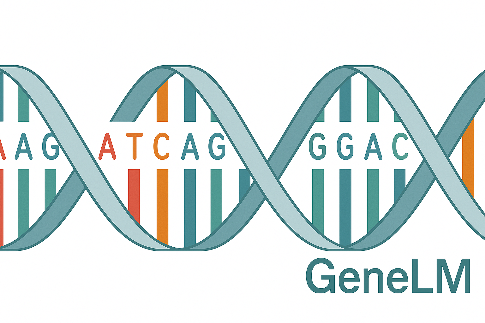
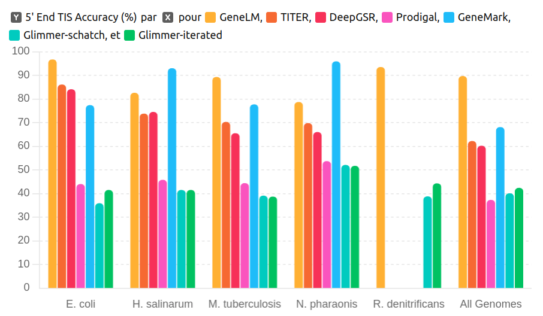
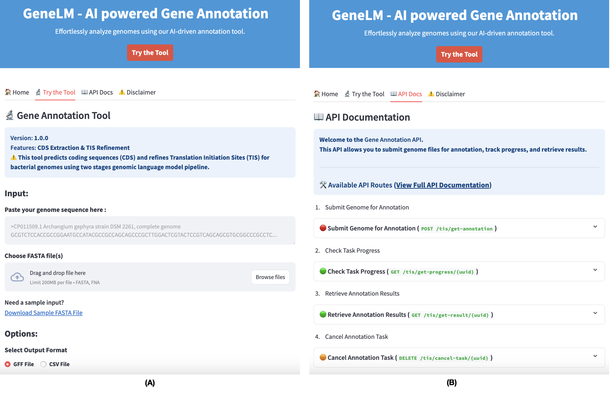
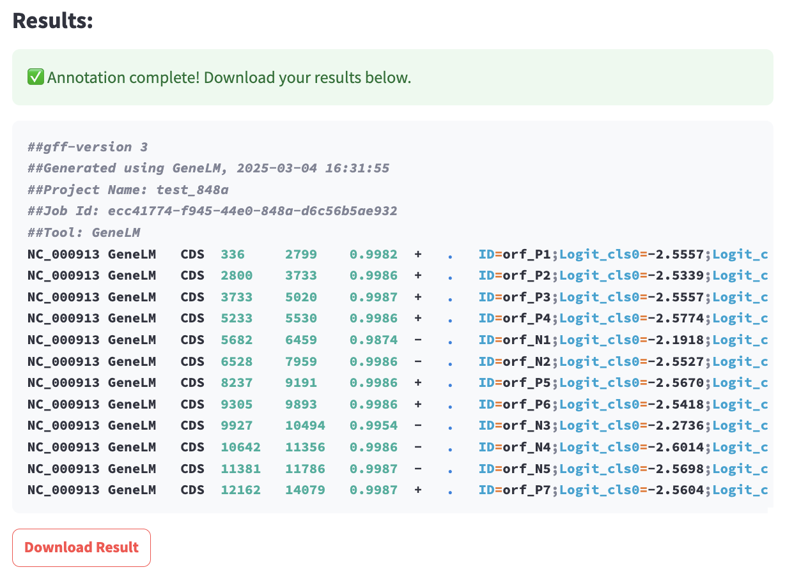

# GeneLM: Gene Language Model for Translation Initiation Site Prediction in Bacteria

<div align="center">
  <br>
  
  <br><br>
  GeneLM: Gene Language Model for Translation Initiation Site Prediction in Bacteria
  <br><br>

  <a href="https://doi.org/10.1093/bib/bbaf311">
    
  </a>
  <a href="https://huggingface.co/Genereux-akotenou/BacteriaCDS-DNABERT-K6-89M">
    
  </a>
  <a href="https://huggingface.co/Genereux-akotenou/BacteriaTIS-DNABERT-K6-89M">
    
  </a>
  <a href="https://hub.docker.com/r/13365920/genelm-webtool">
    
  </a>
</div>

---

## **Online GeneLM Platform**

We are pleased to announce that **GeneLM is now available online**:

👉 **[http://bioinformatics.um6p.ma/GeneLM](http://bioinformatics.um6p.ma/GeneLM)**

No installation is required — simply upload a FASTA genome or paste a sequence to receive:

* CDS predictions
* Translation Initiation Site (TIS) refinement
* Gene annotation tables (CSV, GFF)
* Interactive visualization

⚠️ **Note:** The online platform currently runs **on CPU only**, which may lead to longer processing times for large bacterial genomes.

---

## GeneLM Overview

<a href="https://genereux-akotenou.github.io/assets/images/demo-gene-prediction-prokaryotes.mp4" target="_blank">
  
</a>

GeneLM is a genomic language model designed to improve **coding sequence (CDS) prediction** and **Translation Initiation Site (TIS) identification** in bacterial genomes.
It operates through a **two-stage transformer-based pipeline**, combining:

1. **CDS classification**
2. **TIS refinement**

The repository contains:

* Model source code
* Pretrained + fine-tuned models
* Command-line tools
* Web-based visualization tool
* Docker deployment setup

Training includes **general pre-training** and **task-specific fine-tuning**.
Model training code is available in the [`finetune/`](./finetune/) directory, and the web interface is located in [`webtool/`](./webtool/).

---

## Benchmark

GeneLM was evaluated against **Prodigal** using experimentally verified datasets.
Results are shown below:



For full details, read our paper:
📄 [https://doi.org/10.1093/bib/bbaf311](https://doi.org/10.1093/bib/bbaf311)

---

# 1. Run as Command Line

> NEW: GeneLM can now be executed directly from the command line for FASTA annotation (CPU, GPU, or SLURM HPC).

See: [`README.CommandLine.md`](./run-as-script/README.md)

---

# 2. Run as Web Server (Local Deployment)

The local web tool offers:

* **Direct sequence input** or **FASTA upload**
* **CSV or GFF output**
* **Interactive genome visualization**

Example interface:



---

## 2.1 Environment Setup

### Quick Start (Recommended)

```sh
cd webtool
chmod +x setup-and-run.sh
./setup-and-run.sh
```

This automatically:

* Creates a Python environment
* Installs dependencies
* Launches the API + Web UI

Requires ports **8501** (UI) and **8000** (API).

### Manual Setup

#### Step 1: Create Environment

```sh
git clone https://github.com/Bioinformatics-UM6P/GeneLM
cd webtool
python -m venv venv
```

#### Step 2: Activate Environment

```sh
source ./venv/bin/activate
```

#### Step 3: Install Dependencies

```sh
pip install -r requirements.txt
```

### 2.2 Launch UI

```sh
streamlit run ui/app.py
```

### 2.3 Start API

```sh
uvicorn --app-dir api api:app --host 127.0.0.1 --port 8000 --reload
```

### 2.4 Annotate a Genome

Upload a FASTA file and obtain:



---

# 3. Loading GeneLM from Hugging Face (Quick Inference)

### Load the CDS classifier

```python
import torch
from transformers import AutoModelForSequenceClassification, AutoTokenizer

model_checkpoint = "Genereux-akotenou/BacteriaCDS-DNABERT-K6-89M"
model = AutoModelForSequenceClassification.from_pretrained(model_checkpoint)
tokenizer = AutoTokenizer.from_pretrained(model_checkpoint)
```

### Generate 6-mers

```python
def generate_kmer(sequence, k, overlap=1):
    return " ".join([sequence[j:j+k] for j in range(0, len(sequence) - k + 1, overlap)])
```

### Run inference

```python
sequence = "ATGAGAACCAGCCGGAGACCTCCTGCTCGTACATGAAAGGCTCGAGCAGCCGGGCGAGGGCGGTAG"
seq_kmer = generate_kmer(sequence, k=6, overlap=3)

inputs = tokenizer(seq_kmer, return_tensors="pt", max_length=tokenizer.model_max_length,
                   padding="max_length", truncation=True)

with torch.no_grad():
    outputs = model(**inputs)
    predicted_class = torch.argmax(outputs.logits, dim=-1).item()
```

Use the TIS-refinement model for stage 2:
👉 [https://huggingface.co/Genereux-akotenou/BacteriaTIS-DNABERT-K6-89M](https://huggingface.co/Genereux-akotenou/BacteriaTIS-DNABERT-K6-89M)

---

# 4. Fine-tuning

Fine-tuning resources are located in `finetune/`:

### Folder Structure

| Folder            | Description                                |
| ----------------- | ------------------------------------------ |
| `data-pipeline/`  | Data preparation, cleaning, and formatting |
| `train-pipeline/` | Training scripts, configs, hyperparameters |

### Steps

1. Preprocess genomic data
2. Fine-tune GeneLM
3. Evaluate results
4. Generate reports & metrics

---

# 5. Citation

If you use GeneLM, please cite:

```bibtex
@article{10.1093/bib/bbaf311,
    author = {Akotenou, Genereux and El Allali, Achraf},
    title = {Genomic language models (gLMs) decode bacterial genomes for improved gene prediction and translation initiation site identification},
    journal = {Briefings in Bioinformatics},
    volume = {26},
    number = {4},
    pages = {bbaf311},
    year = {2025},
    month = {07},
    issn = {1477-4054},
    doi = {10.1093/bib/bbaf311},
    url = {https://doi.org/10.1093/bib/bbaf311},
    eprint = {https://academic.oup.com/bib/article-pdf/26/4/bbaf311/63649237/bbaf311.pdf},
}
```

