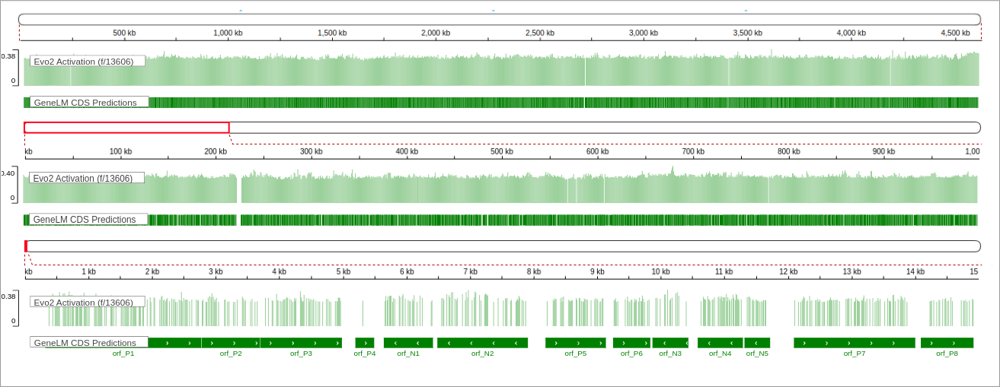

    GeneLM: Benchmarking

### Comparison with Verified Annotations: Benchmarking of traditional TIS annotation tools across five experimentally verified
bacterial genomes. Reported metrics include the number of matched TIS (5’+3’ ends and 3’ ends only). For each genome, the percentages of
correctly predicted ends are shown in parentheses below the first two columns. The final row summarizes performance across the entire set
of organisms.

| Method | Bacteria | GC | Verified TIS | GeneLM (5’+3’ ends) | GeneLM (3’ end) | GeneLM (Found CDS) | Prodigal v3.0 (5’+3’ ends) | Prodigal v3.0 (3’ end) | Prodigal v3.0 (Found CDS) | GeneMark-HMM v2.8 (5’+3’ ends) | GeneMark-HMM v2.8 (3’ end) | GeneMark-HMM v2.8 (Found CDS) | Glimmer-schatch v3.02 (5’+3’ ends) | Glimmer-schatch v3.02 (3’ end) | Glimmer-schatch v3.02 (Found CDS) | Glimmer-iterated v3.02 (5’+3’ ends) | Glimmer-iterated v3.02 (3’ end) | Glimmer-iterated v3.02 (Found CDS) |
|--------|----------|----|---------------|----------------------|------------------|---------------------|-----------------------------|-------------------------|------------------------------|-------------------------------|-----------------------------|--------------------------------|-----------------------------------|-------------------------------|-----------------------------------|-------------------------------------|-------------------------------|-------------------------------------|
| 0 | Escherichia_coli_K_12_substr__MG1655_uid57779 | 50.8 | 769 | 744 (96.7%) | 768 (99.9%) | 4213 | 338 (44.0%) | 345 (44.9%) | 4347 | 595 (77.4%) | 759 (98.7%) | 4308 | 276 (35.9%) | 366 (47.6%) | 4397 | 319 (41.5%) | 369 (48.0%) | 4478 |
| 1 | Halobacterium_salinarum_R1_uid61571 | 65.7 | 530 | 438 (82.6%) | 514 (97.0%) | 2659 | 243 (45.8%) | 255 (48.1%) | 2851 | 493 (93.0%) | 530 (100.0%) | 2762 | 220 (41.5%) | 266 (50.2%) | 2717 | 220 (41.5%) | 265 (50.0%) | 2762 |
| 2 | Mycobacterium_tuberculosis_H37Rv_uid57777 | 65.6 | 701 | 626 (89.3%) | 695 (99.1%) | 3853 | 311 (44.4%) | 342 (48.8%) | 4204 | 545 (77.7%) | 694 (99.0%) | 4029 | 274 (39.1%) | 353 (50.4%) | 4240 | 271 (38.7%) | 352 (50.2%) | 4349 |
| 3 | Natronomonas_pharaonis_DSM_2160_uid58435 | 63.1 | 315 | 248 (78.7%) | 302 (95.9%) | 2737 | 169 (53.7%) | 176 (55.9%) | 2873 | 302 (95.9%) | 314 (99.7%) | 2826 | 164 (52.1%) | 178 (56.5%) | 2878 | 163 (51.7%) | 178 (56.5%) | 2894 |
| 4 | Roseobacter_denitrificans_Och114 | 58.9 | 526 | 492 (93.5%) | 523 (99.4%) | 4006 | 0 (0.0%) | 0 (0.0%) | 4120 | 0 (0.0%) | 0 (0.0%) | 4104 | 204 (38.8%) | 273 (51.9%) | 4260 | 233 (44.3%) | 275 (52.3%) | 4345 |
| 5 | All Genomes | - | 2841 | 2548 (89.7%) | 2802 (98.6%) | 17468 | 1061 (37.3%) | 1118 (39.4%) | 18395 | 1935 (68.1%) | 2297 (80.9%) | 18029 | 1138 (40.1%) | 1436 (50.5%) | 18492 | 1206 (42.4%) | 1439 (50.7%) | 18828 |

### Comparison with Genbank Annotations: Benchmark of gene-finding algorithms against GenBank annotations across five bacterial
genomes. Each entry shows the number and percentage of predicted genes that matched GenBank annotations at the 3’ end, as well as full
matches (5’+3’). Although GenBank genes are not experimentally verified, this benchmark provides a broad overview of performance on
complete genomes. This table is just meant to provide a snapshot of performance over entire genomes.

| Method | Bacteria | GC | GeneBank | GeneLM (5’+3’) ends) | GeneLM (3’ end) | GeneLM (Found CDS) | Prodigal v3.0 (5’+3’) ends) | Prodigal v3.0 (3’ end) | Prodigal v3.0 (Found CDS) | GeneMark-HMM v2.8 (5’+3’) ends) | GeneMark-HMM v2.8 (3’ end) | GeneMark-HMM v2.8 (Found CDS) | Glimmer-schatch v3.02 (5’+3’) ends) | Glimmer-schatch v3.02 (3’ end) | Glimmer-schatch v3.02 (Found CDS) | Glimmer-iterated v3.02 (5’+3’) ends) | Glimmer-iterated v3.02 (3’ end) | Glimmer-iterated v3.02 (Found CDS) |
|--------|----------|----|----------|------------------------|------------------|---------------------|-------------------------------|-------------------------|------------------------------|----------------------------------|-----------------------------|----------------------------------|-------------------------------------|-------------------------------|-----------------------------------|---------------------------------------|-------------------------------|-------------------------------------|
| 0 | Escherichia coli MG1655 | 50.8 | 4140 | 3767 (91.0%) | 4033 (97.5%) | 4213 | 1863 (45.0%) | 1968 (47.6%) | 4347 | 3098 (74.8%) | 3973 (96.0%) | 4308 | 1474 (35.6%) | 2013 (48.6%) | 4397 | 1724 (41.6%) | 2026 (49.0%) | 4478 |
| 1 | Halobacterium salinarum R1 | 65.7 | 2749 | 1871 (68.1%) | 2559 (93.1%) | 2659 | 1079 (39.3%) | 1270 (46.2%) | 2851 | 2174 (79.1%) | 2590 (94.2%) | 2762 | 886 (32.2%) | 1244 (45.3%) | 2717 | 900 (32.7%) | 1244 (45.3%) | 2762 |
| 2 | Mycobacterium tuberculosis H37Rv | 65.6 | 3906 | 2664 (68.2%) | 3709 (95.0%) | 3853 | 1432 (36.7%) | 1904 (48.7%) | 4204 | 2507 (64.2%) | 3745 (95.9%) | 4029 | 1251 (32.0%) | 1931 (49.4%) | 4240 | 1264 (32.4%) | 1939 (49.6%) | 4349 |
| 3 | Natronomonas pharaonis DSM 2160 | 63.1 | 2820 | 1978 (70.1%) | 2671 (94.7%) | 2737 | 1313 (46.6%) | 1461 (51.8%) | 2873 | 2424 (86.0%) | 2748 (97.4%) | 2826 | 1186 (42.1%) | 1483 (52.6%) | 2878 | 1217 (43.2%) | 1484 (52.6%) | 2894 |
| 4 | Roseobacter denitrificans Och114 | 58.9 | 4057 | 3278 (80.8%) | 3927 (96.8%) | 4006 | 0 (0.0%) | 0 (0.0%) | 4120 | 0 (0.0%) | 0 (0.0%) | 4104 | 1322 (32.6%) | 2002 (49.3%) | 4260 | 1528 (37.7%) | 2025 (49.9%) | 4345 |
| 5 | **All Genomes (avg)** | - | 17672 | 13558 (76.7%) | 16899 (95.6%) | 17468 | 5687 (32.2%) | 6603 (37.4%) | 18395 | 10203 (57.7%) | 13056 (73.9%) | 18029 | 6119 (34.6%) | 8673 (49.1%) | 18492 | 6633 (37.5%) | 8718 (49.3%) | 18828 |

### Comparison with Deep Learning Approach on TIS Taks: Translation Initiation Site prediction performance of deep learning models
across five experimentally verified bacterial genomes. Values indicate the number of correctly predicted TIS at the 5’ end, with corresponding
percentages shown in parentheses. GeneLM achieves the highest performance across all organisms.

| Species            | GC   | Verified TIS | GeneLM (5’ end) | TITER (5’ end) | DeepGSR (5’ end) |
|--------------------|------|---------------|------------------|----------------|------------------|
| E. coli            | 50.8 | 769           | 744 (96.7%)      | 662 (86.1%)    | 647 (84.1%)      |
| H. salinarum       | 65.7 | 530           | 438 (82.6%)      | 391 (73.8%)    | 395 (74.5%)      |
| M. tuberculosis    | 65.6 | 701           | 626 (89.3%)      | 493 (70.3%)    | 459 (65.5%)      |
| N. pharaonis       | 63.1 | 315           | 248 (78.7%)      | 220 (69.8%)    | 208 (66.0%)      |
| R. denitrificans   | 58.9 | 526           | 492 (93.5%)      | 0 (0.0%)       | 0 (0.0%)         |
| **All Genomes**    | –    | 2841          | 2548 (89.7%)     | 1766 (62.2%)   | 1709 (60.2%)     |

### Evo2 Activation vs. GeneLM CDS Predictions on the E. coli Genome. Multi -scale visualization of Evo2 feature activation (f/13606 ) alongside GeneLM -predicted CDS regions. 
Top panel: Full genome view showing consistent alignment between Evo2 activations and GeneLM CDS predictions across the E. coli K -12 genome. Middle panel: 1 Mbp region zoomed to highlight local activation density and fine -grained GeneLM boundaries. Bottom panel: Zoom into a 15 kbp region illustrating the near -basepair alignment between Evo2 feature activations and GeneLM -predicted ORFs. These patterns suggest that Evo2 captures biologically relevant signals for coding regions, closely matching the supervised outputs of GeneLM. Visualization adapted using IGV.js.

