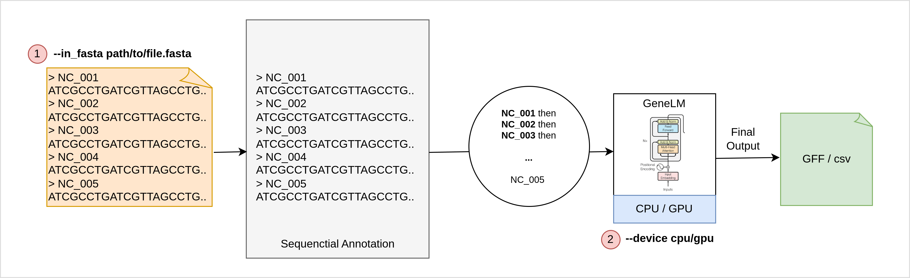
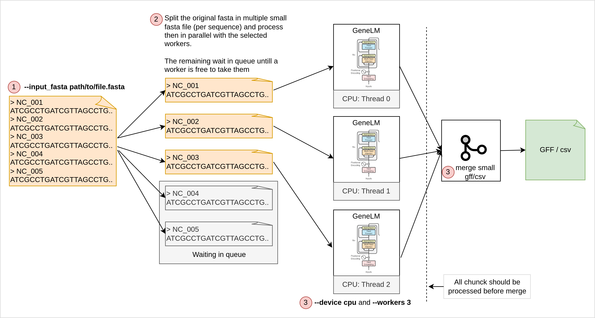
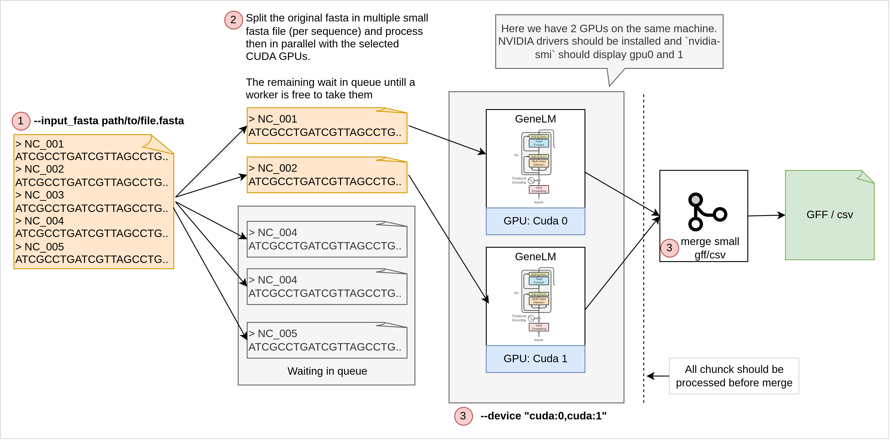

<div align="center" style="">
  <br>
  
  <br>
  <b>GeneLM</b>: Gene Language Model for Translation Initiation Site Prediction in Bacteria
  <br>
  <br>
  <p>****</p>
  <p>GeneLM-Script Runner (split - parallel - merge)</p>
</div>

---

#### Quick start

First of all you need to setup genelm environment to be able to annotate gene using GeneLM.
- Download:
Download only this folder (`GeneLM/run-as-script`) - it’s enough to run the annotation scripts: 
- Setup:

```bash
python -m venv .genelm_env
source .genelm_env/bin/activate
pip install -r genelm/requirements.txt 
```

<br>


#### Usage

**1. Single sequence**




Use this when your FASTA contains one record (or when you want to process a fasta file in sequential). It runs the full AnnotatorPipeline once and writes a single GFF/CSV result.
`--device` lets you force CPU or select a GPU (e.g., cuda:0).
If you pass `--out_dir`, the produced file is copied there; otherwise it stays in `__files__/results`.
```bash
python run_single.py \
  --in_fasta smoke-test/sequence_tiny.fasta \
  --format GFF \
  --device cpu \
  --out_dir __files__/results
```
**Optional Args**: `--filename my_result` or `--filename my_result.gff`: lets you specify a custom output file name (the script automatically adds .gff or .csv based on your chosen format). If you don’t set this option, the output filename will be generated from the contig names in your FASTA file, joined by underscores (_), with the appropriate .gff or .csv extension added.
<br>
<br>
<br>


**2. Batch (multi-FASTA)**

Use this for a multi-FASTA: it automatically splits the input into per-record FASTAs, runs each one in parallel (either on **CPU** or **GPU**), and then merges all per-record outputs into a single file.




```bash
python run_batch.py \
  --input_fasta smoke-test/sequence_tiny_mixt.fasta \
  --format GFF \
  --device cpu \
  --workers 3 \
  --job_name test-smoke \
  --output __files__/results/t-smoke.gff
```


**Argument Table for High-Level Runner**

| Argument        | Required | Description                                                                                   | Allowed Values / Notes                                                                                                                   | Default       |
| --------------- | -------- | --------------------------------------------------------------------------------------------- | ---------------------------------------------------------------------------------------------------------------------------------------- | ------------- |
| `--input_fasta` | **Yes**  | Path to the multi-FASTA file containing multiple sequences.                                   | Any valid FASTA file path.                                                                                                               | *None*        |
| `--format`      | No       | Output format used for per-record results and the final merged output.                        | `GFF`, `CSV`                                                                                                                             | `GFF`         |
| `--device`      | No       | Device to run **run_single.py** on.                                                           | `cpu` → force CPU mode<br>`gpu` → auto-GPU (not tested) | `None`        |
| `--workers`     | No       | Number of parallel threads (Python threads) used to run multiple FASTA chunks simultaneously. | **GPU:** Must be `1` (avoid GPU memory collisions)<br>**CPU:** Can be >1 (parallel CPU processing)                                       | `1`           |
| `--job_name`    | No       | Name placed in merged **GFF header** for tracking the batch job.                              | Any string                                                                                                                               | `"batch_job"` |
| `--output`      | **Yes**  | Final merged output file path (`.gff` or `.csv`).                                             | Path must end with `.gff` or `.csv`.                                                                                                     | *None*        |
| `--keep_temp`   | No       | Keep temporary directory containing split FASTAs + per-record outputs.                        | Flag; no value. If present → temp dirs kept.                                                                                             |       |
| `--verbose`     | No       | Enable verbose logging passed to run_single.py.                                               | Flag; if set → verbose mode.                                                                                                             |      |

<br>




Below is a minimal test using a tiny mixed FASTA (sequence_tiny_mixt.fasta) to quickly verify GPU scheduling and batch processing.

1 - Use all GPUs automatically
```bash
python run_batch_gpu.py \
  --input_fasta smoke-test/sequence_tiny_mixt.fasta \
  --output __files__/results/t-smoke.gff
```

2 - Use only GPU 0 and GPU 1
```bash
python run_batch_gpu.py \
  --input_fasta smoke-test/sequence_tiny_mixt.fasta \
  --output __files__/results/t-smoke.gff \
  --device "cuda:0,cuda:1"
```

**Argument Table for High-Level Runner**

| Argument        | Required | Description                                                                                                                      | Allowed Values / Notes                                                                                                                      | Default       |
| --------------- | -------- | -------------------------------------------------------------------------------------------------------------------------------- | ------------------------------------------------------------------------------------------------------------------------------------------- | ------------- |
| `--input_fasta` | **Yes**  | Multi-FASTA file containing multiple sequences. Script splits this into per-sequence FASTAs.                                     | Any valid FASTA file path                                                                                                                   | *None*        |
| `--format`      | No       | Output format for per-chunk results and final merged file.                                                                       | `GFF`, `CSV`                                                                                                                                | `GFF`         |
| `--device`      | No       | Controls GPU behavior. If set to a specific GPU (`cuda:0`), only that GPU is used. If not set, script auto-detects all GPUs. |  - auto-detect all GPUs by default<br>- `cuda:0` → use GPU cuda:0 only<br>- `"cuda:0,cuda:1"` → use only GPU 0 and 1<br> | `None`        |
| `--job_name`    | No       | Name inserted into GFF output header and used by the merger.                                                                     | Any string                                                                                                                                  | `"batch_job"` |
| `--output`      | **Yes**  | Final merged output file (`.gff` or `.csv`).                                                                                     | Must end with `.gff` or `.csv`.                                                                                                             | *None*        |
| `--keep_temp`   | No       | Keep temporary directory with split FASTAs and per-chunk results. Useful for debugging.                                          | Flag; if present → keep temp folder                                                                                                         | `False`       |
| `--verbose`     | No       | Enables verbose mode for each GPU job (passed to run_single.py).                                                                 | Flag; if present → verbose                                                                                                                  | `False`       |

<br>
<br>

**2.1. Debug**

When running `run_batch.py` or `run_batch_gpu.py`, the script normally removes all temporary working files after finishing.
To help with debugging, you can preserve all intermediate files by adding: `--keep_temp`.
This keeps the full temporary workspace so you can inspect every step of processing.

When enabled, the script prints a detailed warning like:

```
================================================================================
⚠️ DEBUG MODE ENABLED (--keep_temp)
Temporary folder was NOT deleted.
Debug folder: /tmp/genelm_gpu_batch_abcd1234

Inside this folder you will find:
  • split/          — one FASTA file per sequence
  • chunk_results/  — per-sequence GFF/CSV results (from run_single)
  • merge_logs/     — merged output (if created)
  • /tmp/genelm_gpu_batch_abcd1234/**/* — additional GeneLM-related temporary files
================================================================================
```

The preserved folder looks like:

```
genelm_gpu_batch_xxxxxx/
│
├── split/
│      00001_recordA.fasta
│      00002_recordB.fasta
│      ...
│
└── chunk_results/
       00001_recordA.gff
       00002_recordB.gff
```

Logs are execptionally here:
```
__files__/results
│
└── ***.log
```

**3. HPC (SLURM)**

Use the provided SLURM helper to run the batch workflow on a cluster.
Arguments: `INPUT_FASTA FORMAT DEVICE WORKERS OUT_FILE JOB_NAME`.
Pick DEVICE=cpu for CPU nodes or cuda:0 on a GPU partition (and set `#SBATCH --gres=gpu:1` inside the script if needed).

```bash
sbatch hpc_slurm_example.sh  data/multi.fna GFF cpu 16 __files__/results/merged.gff my_job
```


